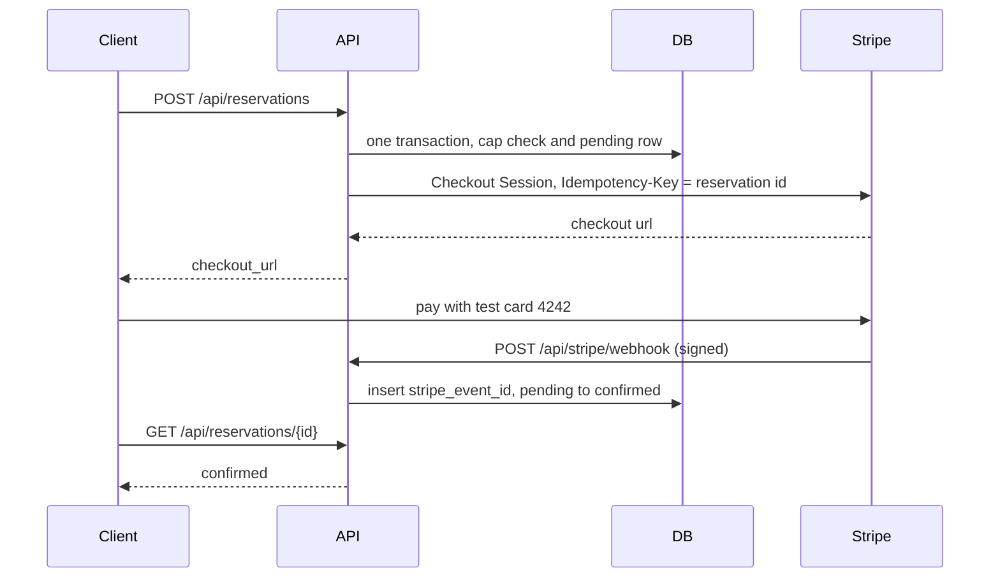

# Local Events

Find upcoming live events near you — and get enough context to decide which one to actually go to.

FastAPI backend, vanilla-JS frontend, data from the [JamBase](https://data.jambase.com/) v3 API.

---

## Quick start

Requires Python 3.12+ and a JamBase API key ([free trial key](https://data.jambase.com/)).

```bash
python3 -m venv .venv && .venv/bin/pip install -r requirements.txt
```

```bash
cp .env.example .env   # then put your key in JAMBASE_API_KEY
```

```bash
.venv/bin/uvicorn app.main:app --reload --port 8000
```

Open <http://127.0.0.1:8000>. Interactive API docs at `/docs`.

Optional — 31 tests, no network, no API key:

```bash
.venv/bin/pip install -r requirements-dev.txt && .venv/bin/python -m pytest
```

I only test the things a wrong answer would look like it works:

| File | What a failure would hide |
| --- | --- |
| `test_mapper.py` | Mapping against a **live** Austin payload; empty `doorTime` filled from showtime; invented titles |
| `test_api.py` | Happy path + Bearer auth; several cities matching `LA` (not auto-picked); unknown city; rejected key; 5xx retried then degraded; 4xx not retried; Near me keeps your coordinates |
| `test_discovery.py` | One dead provider 500ing the request; the same show listed twice; cache not used |
| `test_enrich.py` | Distance invented when geo is missing; a venue-size tag with no capacity |
| `test_provider_jambase.py` | Wrong JamBase query params (silent empty pages) |
| `test_reservations.py` | Oversell under parallel holds; live Stripe key refused; 4xx not retried; 5xx retried; bad webhook signature; duplicate webhook; expired-after-paid left confirmed |

I do not test FastAPI's own 422s, the TTL cache internals, or every capacity-band boundary. Those are either the framework or easy to see in the code.

---

## Stripe payments (test mode)

**Test mode: no real charges.** Checkout uses a Stripe test key (`sk_test_...`). The process refuses to start if `STRIPE_SECRET_KEY` is set and does not start with `sk_test_`. The fee is **$5.00 per spot** (500 cents), quantity 1–4. A hold lasts until Stripe expires the Checkout Session (30 minutes) or the webhook marks it confirmed.

Leave both Stripe variables empty and event search still runs. Reservations return 503 until they are set.

### Flow



If Checkout never opens, the pending row is marked `canceled` and the hold is released. If the buyer leaves Checkout, the row stays `pending` until `checkout.session.expired`.

### State machine

| From | Event | To | Capacity |
| --- | --- | --- | --- |
| — | `POST /api/reservations` | `pending` | counted |
| `pending` | `checkout.session.completed` | `confirmed` | still counted |
| `pending` | `checkout.session.expired` | `expired` | released |
| `pending` | Stripe error while creating the session | `canceled` | released |
| `confirmed` | a later `checkout.session.expired` | `confirmed` | unchanged |

Only `pending` moves. A repeated webhook with the same `stripe_event_id` returns 200 and does nothing.

### Run locally

```bash
stripe listen --forward-to localhost:8000/api/stripe/webhook
```

Put the `whsec_...` from that command in `STRIPE_WEBHOOK_SECRET`. Card: **4242 4242 4242 4242**, any future expiry, any CVC. **Test mode: no real charges.**

### Env vars

| Variable | Role |
| --- | --- |
| `STRIPE_SECRET_KEY` | Test secret. Must start with `sk_test_` or the process will not start. |
| `STRIPE_WEBHOOK_SECRET` | Signing secret for `POST /api/stripe/webhook`. Required when the key is set. |
| `BASE_URL` | Success and cancel URLs. Default `http://127.0.0.1:8000`. |
| `DATABASE_URL` | Async SQLAlchemy URL. Default local SQLite. |
| `RESERVATION_CAP_PER_EVENT` | Pending + confirmed spots per event. Default 10. |

### Design decisions

- **Idempotency key.** The Stripe Idempotency-Key is the reservation id. A retried Checkout create for that row cannot open a second session. A different reservation gets a different key.
- **Webhook dedupe table.** `processed_webhook_events.stripe_event_id` is unique. The insert and the status change are one transaction. A duplicate delivery hits the constraint and returns 200.
- **Transactional capacity.** `event_holds.held_quantity` is updated with `WHERE held + qty <= cap` in the same transaction as the insert. Two overlapping requests cannot both pass a count-then-insert check.
- **Test-mode guard.** A key that does not start with `sk_test_` aborts startup, so a live secret cannot charge cards from this app.

### Render

Set the env vars on the service. In the Stripe dashboard, add a **test-mode** webhook endpoint pointing at `https://<your-service>/api/stripe/webhook` for `checkout.session.completed` and `checkout.session.expired`. Use a Render Postgres `DATABASE_URL` (the app rewrites `postgres://` to `postgresql+asyncpg://`). The free-tier disk is ephemeral, so SQLite on the instance would drop reservations on restart.

---

## Writeup

### Time spent

**~2 hours**, including API reverse-engineering, tests, and this document.

### Technology choices

**FastAPI + Pydantic v2.** Required, and a good fit anyway: the domain models double as
request validation and as the OpenAPI schema, so the contract can't drift from the code.

**httpx.** One async client with a connection pool that lives for the process, rather than a
new TCP+TLS handshake per request. Fanning out to N providers concurrently needs async anyway.

**Vanilla JS, no build step.** The brief said prioritize the backend and that the UI need only
be clean and functional. A React toolchain would have added a `node_modules` install and a
build config to review, and bought nothing for one screen. `git clone` → `uvicorn` → done.

**In-process TTL cache, no Redis.** Correct for a single node; the interface is three methods,
so swapping in a shared cache later is a contained change.

### Backend / API design

The core decision is a **three-layer separation** — provider → service → HTTP — with a
**normalized domain model** at the boundary:

```
app/
  models.py              # provider-agnostic domain types
  providers/
    base.py              # EventProvider ABC  <- the seam
    registry.py          # which providers are live
    jambase/
      client.py          #   transport: auth, timeouts, retries
      mapper.py          #   JamBase schema.org -> domain models
      provider.py        #   EventSearch -> JamBase's param dialect
  services/
    discovery.py         # fan-out, dedupe, rank, cache
    enrich.py            # derived decision signals
  api/routes.py          # thin: parse, delegate, serialize
```

Nothing above `providers/` knows JamBase exists. `main.py` is the only file that names a
concrete provider, and it does so in one line.

Three deliberate choices worth calling out:

- **Failure is isolated per provider.** `DiscoveryService._fetch_one` converts *any* exception
  into a `ProviderStatus(ok=False)`. One dead upstream degrades the result set; it never 500s
  the request. This is the property that stops being optional the moment there are 10 sources.
- **Retries only where retrying helps.** 429/5xx/timeouts get two retries with exponential
  backoff; 4xx fails immediately (a malformed query won't fix itself, and retrying burns quota);
  401/403 raises a distinct `ProviderAuthError` because that's an operator problem, not a user one.
- **Splitting `resolve_location` from `search_events`** on the provider interface. Not every
  source geocodes, so the registry picks a capable provider for step one and still fans step two
  out to everything.

### UI design decisions — what helps someone actually choose

Core event info is table stakes. The interesting question was *what else*, and the answer came
from what JamBase returns that a naive listing throws away:

| Signal | Why it helps you decide | Derived from |
| --- | --- | --- |
| **Distance** ("3.9 km away") | The single biggest filter on "would I actually go" | Haversine, venue geo vs. your point |
| **Showtime** | Date-only listings hide whether this is an afternoon or a late set | Clock portion of live `startDate` (`2026-08-22T20:00:00`) |
| **Venue size** (raw capacity + Intimate / Arena) | A 200-cap room and a stadium are different nights out | `maximumAttendeeCapacity`, banded |
| **Full lineup** | The support act is often the reason to go | `performer[]`, headliner separated from support |
| **Primary vs. resale tickets** | Face value vs. StubHub markup | `offers[].category` |
| **Genre facets with counts** | Shows the shape of the local scene, not just a filter | Lifted from performer genres |

Missing source values stay missing and render as **not listed** — no "Venue TBA", no invented door time, no price (the live Austin page had `priceSpecification: {}` on most offers).

Time windows are phrased the way people think (**Tonight**, **This weekend**) rather than as date pickers. Sorts are **Soonest** and **Closest** only.

Honest degradation: if a provider fails, the status line says so.

### Tradeoffs made to keep it small

- **One page of results, no pagination.** The API supports it; the UI caps at 60.
- **Genre filtering re-queries upstream** instead of filtering client-side — simpler, one code path.
- **Facet counts are computed over the returned page**, not globally, so a chip can read
  "bluegrass (3)" and return 5 results once selected. Honest fix needs a real aggregation query.
- **Discovery is not persisted.** Search results are not stored. Reservations are the exception: they live in Postgres (or local SQLite) so a webhook can confirm a hold. No user accounts.
- **Dedupe keys on (date, city, headliner)** rather than venue, since venue names vary between
  sources. Two different shows by the same act in one city on one night would over-merge — rare
  enough to accept today, but it's the first thing I'd revisit with a second provider live.

### With more time

1. **Pagination + infinite scroll**, and `ETag`/`Cache-Control` on the events endpoint.
2. **A real geocoder** (Nominatim/Mapbox) so postal codes and neighbourhoods work — JamBase's
   city lookup is city-granularity only and has no `zipCode` parameter.
3. **Map view.** Every venue already carries coordinates; the data is sitting unused.
4. **Shared cache + a stale-while-revalidate layer**, so a cold cache never blocks a user.
5. **Personalization** — connect Spotify, rank by artists you actually listen to.
6. **Accessibility pass**: focus management on re-render, and `aria-live` politeness tuning.

---

## Additional notes

### How I used AI during development

I used an AI coding assistant on the repetitive layer — scaffolding, retries, draft models, tests —
and kept ownership of schema, missing-data rules, and anything that touches correctness.

- **Live payload first.** Before the mapper was rewritten, we fetched a real Austin `/events`
  and `/geographies/cities` response. Mapping is based on that shape (`startDate` as a datetime,
  `doorTime: ""` on 7/8 of the page, city `addressRegion` as `"US-TX"` vs a nested object on venues),
  not on docs or a remembered schema.
- **Boilerplate at speed** — Pydantic models, the TTL cache, CSS. Reviewed, not trusted blindly.
- **Test case generation.** Strong at enumerating edge cases: null-island coordinates, `""`-as-null,
  one bad record in a good batch.
- **What I kept for myself:** the layering, the provider seam, which signals to surface, and every
  fallback. Those are product and architecture calls.

### Something AI suggested that I changed

A few worth reporting.

**Invented names.** An earlier mapper filled gaps with `"Venue TBA"`, `"Unknown artist"`, and
`"Untitled event"`. That looks complete and is wrong. Missing fields now stay `None` and the UI
shows **not listed**. Same rule for door time: we do not copy `startDate`'s clock onto an empty
`doorTime`.

**A "Rare visit" tag.** The assistant wanted to threshold `x-numUpcomingEvents` (e.g. ≤6) and
call it urgency. That is an interpretation the source did not make, and it is easy to ship as if
it were a fact. I rejected it. Capacity bands stayed because they were an explicit, labeled
interpretation of a real number, not a story about touring.

**Picking a city by how busy it is.** The first geocoder ranked JamBase city matches by
`x-numUpcomingEvents` and took the max. That looks like it "found LA" and is wrong: JamBase
prefix-matches `LA` to many `La…` cities, and Las Vegas simply had the most upcoming events.
I asked for the opposite — if more than one city matches, return them and let the user pick.
I also did not add a nickname table (`SF` → San Francisco). `SF` still 404s because JamBase
has no such city; that is the API, not something to paper over.

**A design correction.** The generated mapper computed `capacity_band` inside the JamBase mapper.
That puts a domain rule in a provider adapter. I moved the banding onto the `Venue` model as a
`model_validator` so no provider can forget it or disagree.

### Biggest technical limitation

**Location resolution is city-granularity and single-sourced.** JamBase's `/geographies/cities`
has no postal-code parameter, so "events near 78704" can't be answered precisely — the app
resolves to the city centroid and searches a radius from there. For a large metro that centroid
can sit 15+ km from the user, which visibly skews the `distance` sort. Typed names are also
prefix-matched (`LA` is every `La…` city with upcoming events, not Los Angeles), which is why
the UI asks you to pick when several match. The browser's "Near me" button avoids the centroid
problem (it passes exact coordinates), but typed input can't. The fix is a dedicated geocoder
behind the same interface — deliberately deferred, not overlooked.

Secondary: the cache is per-process, so horizontal scaling multiplies upstream calls.

### Evolving to 10 event providers

The seam is already in place — `EventProvider` + `ProviderRegistry` + a normalized domain model —
so adding a source today means writing a mapper and one `registry.register(...)` line. That much
is done. What genuinely changes at 10 providers:

1. **Fan-out needs a budget.** Today `asyncio.gather` waits for the slowest provider. At 10, I'd
   add a per-provider deadline (~2s) and return whatever landed in time, with the stragglers marked
   `ok=false`. Tail latency should be bounded by the deadline, not by the worst upstream.
2. **A circuit breaker per provider.** After N consecutive failures, skip the provider for a cooldown
   instead of paying its timeout on every request. The `ProviderStatus` plumbing already carries the
   signal needed to drive this.
3. **De-duplication becomes the hard problem.** Ticketmaster, Eventbrite, and JamBase will all list
   the same show with different titles, venue spellings, and slightly different coordinates. The
   current `(date, city, headliner)` key is adequate for one source and won't survive three. I'd move
   to blocking on `(date, geo-hash)` plus fuzzy title/artist similarity, and — importantly — make
   merging *additive*: keep every provider's ticket link on the merged event rather than discarding
   the "loser", since price comparison is the user-visible payoff of multi-sourcing.
4. **Per-provider config and quota.** API key, rate limit, timeout, and enable/disable move into
   declarative per-provider settings rather than shared globals. Providers get registered from config,
   not from a hardcoded line in `main.py`.
5. **Trust weighting.** Sources disagree on facts. `_completeness` is a crude stand-in; real systems
   need per-field precedence (e.g. trust Ticketmaster on price, JamBase on lineup).
6. **Ingestion flips from pull to push.** At 10 providers, querying all of them per user request is
   the wrong shape — latency is bounded by the slowest and quota burns on repeated queries. I'd move
   to periodic background ingestion into a Postgres table with a PostGIS geo index, and serve reads
   from our own store. That also unlocks what the current design can't do at all: global facet counts,
   real pagination, and full-text search. **This is the actual architectural change**; items 1–5 are
   refinements of what's already here.

### Self-assessment

| Area | Grade | Reasoning |
| --- | --- | --- |
| **Code quality** | **A−** | Clear layering, typed throughout, 31 tests aimed at silent-wrong failures (live mapping, retries, provider isolation, ambiguous cities, reservation capacity and webhooks), lint clean. Marked down because the frontend has no tests. |
| **Work product** | **A−** | Complete and working against live data: geocoding, filtering, soonest/closest sort, honest missing-data states. Marked down for no pagination and no map. |
| **Extensibility** | **A** | The provider seam is real, not aspirational — validated by the fact that the entire discovery test suite runs against fake providers, never JamBase. Adding a source touches two files. The known ceiling (cross-provider dedupe, pull-based fan-out) is identified above with a concrete plan rather than left as a surprise. |
